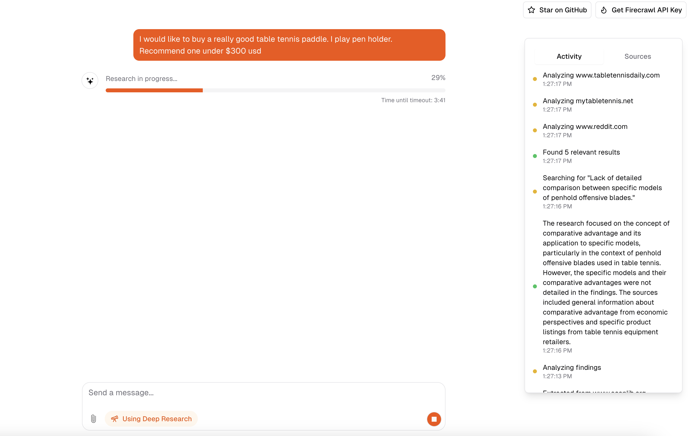

# Open Deep Research

An open-source clone of OpenAI's Deep Research experiment. Instead of using a fine-tuned version of `o3`, this method leverages [Firecrawl's Extract + Search](https://firecrawl.dev/) alongside a reasoning model to conduct deep research on the web.

Check out the [demo](https://x.com/nickscamara_/status/1886459999905521912).



---

## 🚀 Features

### 🔍 Firecrawl Search + Extract
- **Real-time AI-driven research**: Fetch live data from the web via search.
- **Structured data extraction**: Collect relevant information from multiple sources efficiently.

### ⚡ Next.js App Router
- **Optimized performance** with advanced routing.
- **React Server Components (RSCs)** for improved server-side rendering and responsiveness.

### 🤖 AI SDK (Vercel)
- Unified API for generating text, structured objects, and tool calls with LLMs.
- Hooks for dynamic chat and generative UI development.
- Supports OpenAI (default), Anthropic, Cohere, and other providers.

### 🎨 UI & Styling
- **[shadcn/ui](https://ui.shadcn.com)** for a modern design system.
- **[Tailwind CSS](https://tailwindcss.com)** for efficient styling.
- **[Radix UI](https://radix-ui.com)** for accessible and flexible components.

### 💾 Data Persistence
- **[Vercel Postgres](https://vercel.com/storage/postgres)** for chat history and user data.
- **[Vercel Blob](https://vercel.com/storage/blob)** for file storage.

### 🔑 Authentication
- **[NextAuth.js](https://github.com/nextauthjs/next-auth)** for secure and seamless authentication.

---

## 🤝 Model Providers

This project uses `gpt-4o` by default. However, with the [AI SDK](https://sdk.vercel.ai/docs), you can switch to various LLM providers:
- **[OpenAI](https://openai.com)**
- **[Anthropic](https://anthropic.com)**
- **[Cohere](https://cohere.com/)**
- **[OpenRouter](https://openrouter.ai/)**

To use OpenRouter, set the `OPENROUTER_API_KEY` environment variable.

---

## ⏳ Function Execution Time

By default, functions timeout after **300 seconds (5 minutes)**. On Vercel's Hobby tier, reduce this to **60 seconds**:

```bash
MAX_DURATION=60
```

More details [here](https://vercel.com/docs/functions/configuring-functions/duration#duration-limits).

---

## 🚀 Deploy Your Own Instance

Deploy your own version with **one click**:

[](https://vercel.com/new/clone?repository-url=https%3A%2F%2Fgithub.com%2Fnickscamara%2Fopen-deep-research&env=AUTH_SECRET,OPENAI_API_KEY,OPENROUTER_API_KEY,FIRECRAWL_API_KEY,BLOB_READ_WRITE_TOKEN,POSTGRES_URL,UPSTASH_REDIS_REST_URL,UPSTASH_REDIS_REST_TOKEN,REASONING_MODEL,BYPASS_JSON_VALIDATION,TOGETHER_API_KEY,MAX_DURATION&envDescription=Learn%20more%20about%20how%20to%20get%20the%20API%20Keys%20for%20the%20application&envLink=https%3A%2F%2Fgithub.com%2Fvercel%2Fai-chatbot%2Fblob%2Fmain%2F.env.example&demo-title=AI%20Chatbot&demo-description=An%20Open-Source%20AI%20Chatbot%20Template%20Built%20With%20Next.js%20and%20the%20AI%20SDK%20by%20Vercel.&demo-url=https%3A%2F%2Fchat.vercel.ai&stores=[{%22type%22:%22postgres%22},{%22type%22:%22blob%22}])

---

## 🏗 Running Locally

You'll need to configure environment variables. Use the provided [`.env.example`](.env.example) file as a reference.

### ⚠️ Security Notice
Do **not** commit your `.env` file, as it contains sensitive credentials.

### Steps to run locally:

1. **Install Vercel CLI**:
   ```bash
   npm i -g vercel
   ```
2. **Link to Vercel & GitHub**:
   ```bash
   vercel link
   ```
3. **Download environment variables**:
   ```bash
   vercel env pull
   ```
4. **Install dependencies**:
   ```bash
   pnpm install
   ```
5. **Run database migrations**:
   ```bash
   pnpm db:migrate
   ```
6. **Start the application**:
   ```bash
   pnpm dev
   ```

Your app will now be running on **[localhost:3000](http://localhost:3000/)**.

---

## 🔗 Model Dependencies

If using models beyond the default, install the required dependencies.

For **TogetherAI's DeepSeek**:
```bash
pnpm add @ai-sdk/togetherai
```

ℹ️ Check rate limits: [TogetherAI Docs](https://docs.together.ai/docs/rate-limits).

---

## 🧠 Reasoning Model Configuration

This app supports specialized reasoning models for structured research and analysis. Configure via the `REASONING_MODEL` environment variable.

### ✅ Supported Models

| Provider  | Models                    | Notes                                       |
|-----------|---------------------------|---------------------------------------------|
| OpenAI    | `gpt-4o`, `o1`, `o3-mini` | Native JSON schema support                  |
| TogetherAI | `deepseek-ai/DeepSeek-R1` | Requires `BYPASS_JSON_VALIDATION=true`      |

### ⚠️ Important Notes

- **Only OpenAI models (`gpt-4o`, `o1`, `o3-mini`)** natively support structured JSON outputs.
- **For non-OpenAI models** (e.g., `DeepSeek-R1`), disable JSON validation:
  ```bash
  BYPASS_JSON_VALIDATION=true
  ```
- The reasoning model is used for:
  - Research analysis
  - Document structuring
  - Data extraction
  - Structured responses
- Defaults to `o1-mini` if no model is specified.

### 🔧 Configuration Example

```bash
REASONING_MODEL=google/gemini-2.5-pro-exp-03-25:free
BYPASS_JSON_VALIDATION=true
```

The reasoning model is **automatically applied** when structured responses or analysis are required.

---
